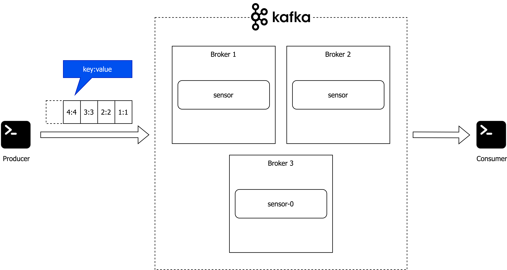
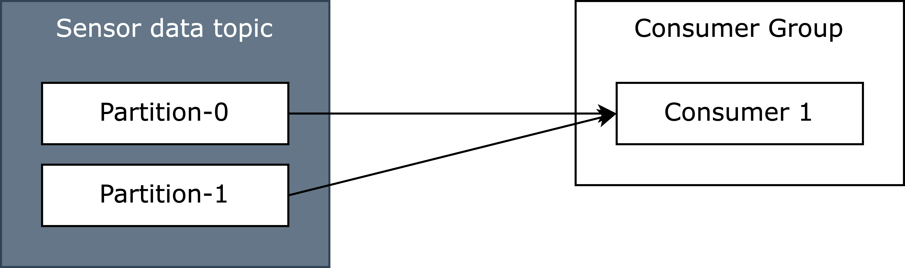
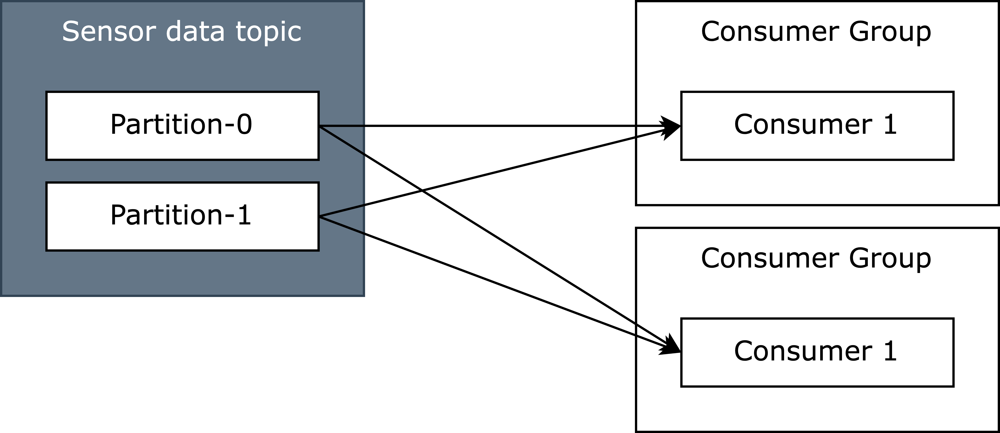
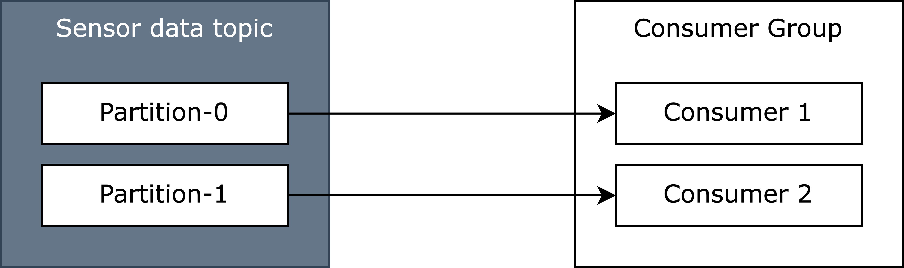
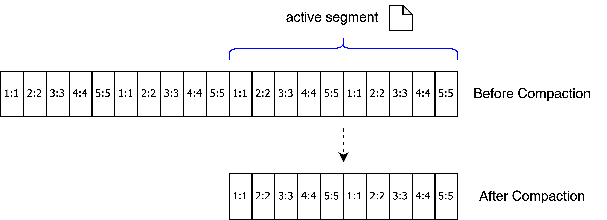

# Kafka Cluster

## Start the cluster

Start 3 Zookeeper hosts

```
docker run -d \
   --net=host \
   --name=zk-1 \
   -e ZOOKEEPER_SERVER_ID=1 \
   -e ZOOKEEPER_CLIENT_PORT=22181 \
   -e ZOOKEEPER_TICK_TIME=2000 \
   -e ZOOKEEPER_INIT_LIMIT=5 \
   -e ZOOKEEPER_SYNC_LIMIT=2 \
   -e ZOOKEEPER_SERVERS="localhost:22888:23888;localhost:32888:33888;localhost:42888:43888" \
   confluentinc/cp-zookeeper:7.3.2

docker run -d \
   --net=host \
   --name=zk-2 \
   -e ZOOKEEPER_SERVER_ID=2 \
   -e ZOOKEEPER_CLIENT_PORT=32181 \
   -e ZOOKEEPER_TICK_TIME=2000 \
   -e ZOOKEEPER_INIT_LIMIT=5 \
   -e ZOOKEEPER_SYNC_LIMIT=2 \
   -e ZOOKEEPER_SERVERS="localhost:22888:23888;localhost:32888:33888;localhost:42888:43888" \
   confluentinc/cp-zookeeper:7.3.2

docker run -d \
   --net=host \
   --name=zk-3 \
   -e ZOOKEEPER_SERVER_ID=3 \
   -e ZOOKEEPER_CLIENT_PORT=42181 \
   -e ZOOKEEPER_TICK_TIME=2000 \
   -e ZOOKEEPER_INIT_LIMIT=5 \
   -e ZOOKEEPER_SYNC_LIMIT=2 \
   -e ZOOKEEPER_SERVERS="localhost:22888:23888;localhost:32888:33888;localhost:42888:43888" \
   confluentinc/cp-zookeeper:7.3.2
```

Start 3 Kafka Broker instances

```
docker run -d \
    --net=host \
    --name=kafka-1 \
    -e KAFKA_BROKER_ID=1 \
    -e KAFKA_ZOOKEEPER_CONNECT=localhost:22181,localhost:32181,localhost:42181 \
    -e KAFKA_ADVERTISED_LISTENERS=PLAINTEXT://localhost:19092 \
    confluentinc/cp-kafka:7.3.2

docker run -d \
    --net=host \
    --name=kafka-2 \
    -e KAFKA_BROKER_ID=2 \
    -e KAFKA_ZOOKEEPER_CONNECT=localhost:22181,localhost:32181,localhost:42181 \
    -e KAFKA_ADVERTISED_LISTENERS=PLAINTEXT://localhost:29092 \
    confluentinc/cp-kafka:7.3.2

 docker run -d \
     --net=host \
     --name=kafka-3 \
     -e KAFKA_BROKER_ID=3 \
     -e KAFKA_ZOOKEEPER_CONNECT=localhost:22181,localhost:32181,localhost:42181 \
     -e KAFKA_ADVERTISED_LISTENERS=PLAINTEXT://localhost:39092 \
     confluentinc/cp-kafka:7.3.2
```

Verify that all 6 containers are up and running

```
docker ps
```

## Exercise 1: Create sensor topic



Start an interactive shell that is attached to our cluster net and contains the kafka command line shell
scripts

```
docker run -it --net=host --rm  confluentinc/cp-kafka:7.3.2 /bin/bash
```

Navigate to the `/bin` directory to find the Kafka scripts

```
cd /bin
```

Create a `sensor` topic

```
 ./kafka-topics --bootstrap-server localhost:19092 --create --topic sensor --partitions 1 --replication-factor 3 --if-not-exists
```

Check if the topic is there

```
./kafka-topics --bootstrap-server localhost:19092 --list
```

Which broker is the leader?

```
./kafka-topics --bootstrap-server localhost:19092 --describe --topic sensor
```

* all reads and writes go through the leader

Shutdown the leader. Which broker is the leader now?

```
docker stop <container>
```

* ISR

```
./kafka-topics --bootstrap-server localhost:19092 --describe --topic sensor
```

Start the broker that was not running.

```
docker start <container>
```

💡 you can stop and start a broker by using `docker stop` as well as `docker start` and the container name for broker (
e.g., kafka-1 for the first broker)

## Exercise 2: Produce and consume messages

Generate sensor data:

```
seq 42 | sed 's/\([0-9]\+\)/\1:\1/g' | ./kafka-console-producer --broker-list localhost:19092 --topic sensor  --property parse.key=true --property key.separator=: && echo 'Produced 42 messages.'
```

* Kafka console producer
* Generates 42 messages 0:0, 1:1, 2:2, usw. and sends them to sensor topic

Consume the sensor data:

```
./kafka-console-consumer --bootstrap-server localhost:19092,localhost:29092,localhost:39092 --from-beginning --property print.key=true --property key.separator=":" --topic sensor
```

* Kafka console consumer
* from beginning
* ordered

## Exercise 3: Partitioning and Consumer groups


Create the `sensor2` topic with 2 partitions and 3 replicas

```
./kafka-topics --bootstrap-server localhost:19092 --create --topic sensor2 --partitions 2 --replication-factor 3 --if-not-exists
```

Generate Sensordata

```
seq 42 | sed 's/\([0-9]\+\)/\1:\1/g' | ./kafka-console-producer --broker-list localhost:19092 --topic sensor2  --property parse.key=true --property key.separator=: && echo 'Produced 42 messages.'
```

Read Sensordata

```
./kafka-console-consumer --bootstrap-server localhost:19092,localhost:29092,localhost:39092 --from-beginning --property print.key=true --property key.separator=":" --topic sensor2
```

### Consumer Groups



List consumer groups

```
./kafka-consumer-groups --bootstrap-server localhost:19092 --list
```

Consumer group details

```
./kafka-consumer-groups --bootstrap-server localhost:19092 --describe --group GROUP
```

Read the data from topic sensor2 with two consumers



Open new Terminal window

```
docker run -it --net=host --rm  confluentinc/cp-kafka:7.3.2 /bin/bash
```

```
cd /bin
```

```
./kafka-console-consumer --bootstrap-server localhost:19092,localhost:29092,localhost:39092 --property print.key=true --property key.separator=":" --topic sensor2
```

Generate Sensordata

```
seq 42 | sed 's/\([0-9]\+\)/\1:\1/g' | ./kafka-console-producer --broker-list localhost:19092 --topic sensor2  --property parse.key=true --property key.separator=: && echo 'Produced 42 messages.'
```

### Multiple consumers in one group



Open 2 new Terminal windows

```
docker run -it --net=host --rm  confluentinc/cp-kafka:7.3.2 /bin/bash
```

```
cd /bin
```

Consume data from topic sensor2 with two consumers parallel, from the same consumer group (using the --group property)

```
./kafka-console-consumer --bootstrap-server localhost:19092,localhost:29092,localhost:39092 --property print.key=true --property key.separator=":" --topic sensor2 --group myGroup
```

Generate Sensordata

```
seq 42 | sed 's/\([0-9]\+\)/\1:\1/g' | ./kafka-console-producer --broker-list localhost:19092 --topic sensor2  --property parse.key=true --property key.separator=: && echo 'Produced 42 messages.'
```

Consumer group details

```
./kafka-consumer-groups --bootstrap-server localhost:19092 --describe --group myGroup
```

## Exercise 4: Log Compaction



The goal of log compaction is reducing the log size by retaining only the latest message per key.

Be aware that there may still be multiple messages per key.
Kafka partitions are stored in segments (files) under the hood and the current segment is never affected by log compaction.

In ths exercise, we configure the sensor topic for log compaction. For a production like setup you would most probably
use the parameter _min.cleanable.dirty.ratio_. To check the log compaction feature in our lab, you should set the
following paramters for the new topic sensor3:

```
./kafka-topics --bootstrap-server localhost:19092 --create --topic sensor3 --partitions 1 --replication-factor 3 --if-not-exists

./kafka-configs --alter --add-config cleanup.policy=compact --entity-type topics --entity-name sensor3 --bootstrap-server localhost:19092

./kafka-configs --alter --add-config max.compaction.lag.ms=1000 --entity-type topics --entity-name sensor3 --bootstrap-server localhost:19092
 
./kafka-configs --alter --add-config segment.bytes=256 --entity-type topics --entity-name sensor3 --bootstrap-server localhost:19092
```

```
./kafka-configs --describe --entity-type topics --entity-name sensor3 --bootstrap-server localhost:19092
```

Now, you start producing data.
Execute this multiple times:

```
seq 5 | sed 's/\([0-9]\+\)/\1:\1/g' | ./kafka-console-producer --broker-list localhost:19092 --topic sensor3  --property parse.key=true --property key.separator=: && echo 'Produced 5 messages.'
```

Consume the compacted topic

```
./kafka-console-consumer --bootstrap-server localhost:19092,localhost:29092,localhost:39092 --from-beginning --topic sensor3
```