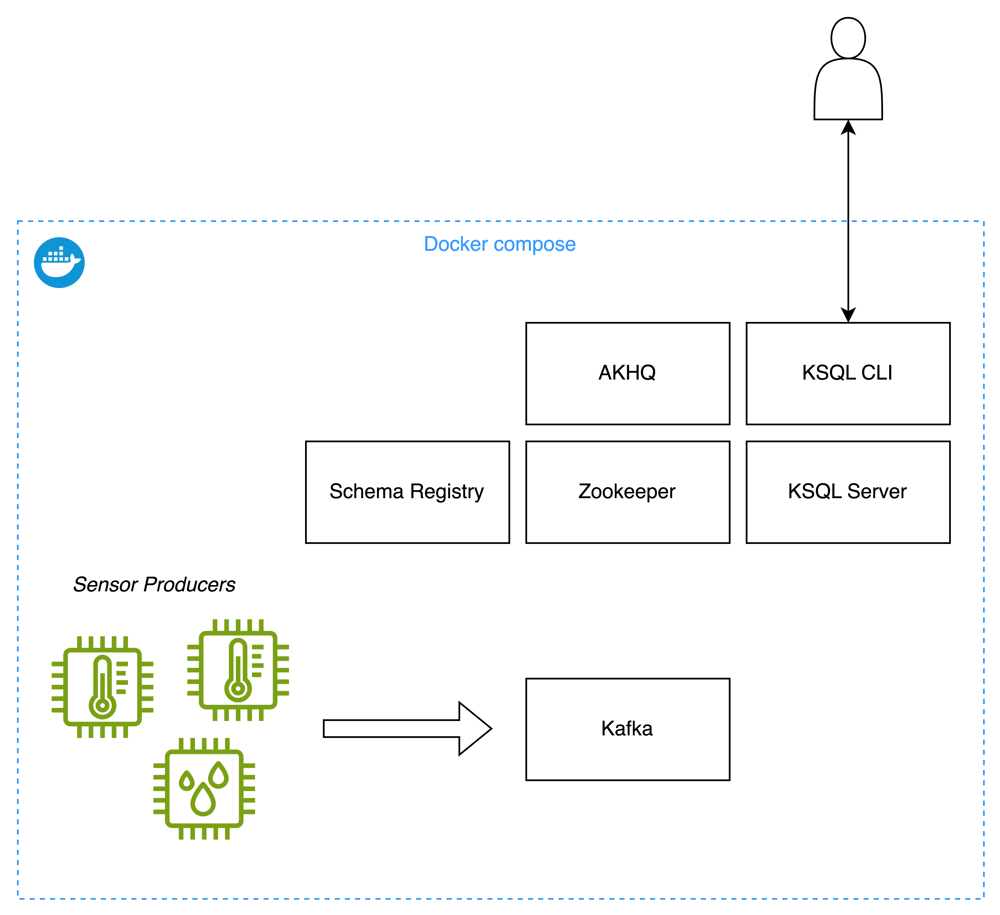

# KSQL

## Initial Setup



Run Maven Build

```
mvn clean install
```

Start docker compose

```
docker compose up -d --build
```

Open AKHQ

http://localhost:8080/ui/docker-kafka-server/topic/sensor

Open KSQL CLI

```
docker-compose exec ksqldb-cli ksql http://ksqldb-server:8088
```

Explore Topics, Streams and Tables:

```
SHOW TOPICS;
SHOW TABLES;
SHOW STREAMS;
```

💡 You can find all statements in
the [KSQL Reference](https://docs.ksqldb.io/en/latest/developer-guide/ksqldb-reference/)

## Exercise 1 - create a stream in KSQL

Create a Stream for the `sensor` Topic:

```
CREATE STREAM sensor_stream(sensor_id varchar, type varchar, unit varchar, value double) 
WITH (KAFKA_TOPIC = 'sensor', value_format='AVRO');
```

💡 See the possible [data types](https://docs.ksqldb.io/en/latest/reference/sql/data-types/) in the KSQL documentation.

Describe the stream

```
DESCRIBE sensor_stream;
```

Get the content from the stream

```
SELECT * FROM sensor_stream emit changes;
```

Currently you see only new data that is generated on your Topic. If you want to see all data, you can change the offset
reset:

```
SET 'auto.offset.reset' = 'earliest';
```

## Excercise 2 - create a stream from another stream for Temperature and Humidity

Create separate streams for `Temperature` and `Humidity` sensors

```
CREATE STREAM temparature_sensors_stream
AS select sensor_id, type, unit, value from sensor_stream where type = 'Temperature';
```

```
CREATE STREAM humidity_sensors_stream
AS select sensor_id, type, unit, value from sensor_stream where type = 'Humidity';
```

Check the content of your new Streams:

```
SELECT * FROM temparature_sensors_stream emit changes;
```

```
SELECT * FROM humidity_sensors_stream emit changes;
```

## Excercise 3 - Count measurements by sensor (Aggregations)

```
SELECT sensor_id, COUNT(*) AS count 
FROM sensor_stream GROUP BY sensor_id 
EMIT CHANGES;
```

Create a materialized view

```
CREATE TABLE sensor_count_AS 
 AS 
SELECT sensor_id, COUNT(*) AS count 
FROM sensor_stream GROUP BY sensor_id 
EMIT CHANGES;
```

Query against the table

```
SELECT * FROM sensor_count_table;
```

## Excercise 4 - Show latest value by sensor

```
CREATE TABLE sensor_latest_value_table AS 
SELECT sensor_id, LATEST_BY_OFFSET(value) AS current 
FROM sensor_stream GROUP BY sensor_id 
EMIT CHANGES;
```

```
SELECT * FROM sensor_latest_value_table;
```

## Excercise 5 - Average sensor values with tumbling window

```
CREATE TABLE sensor_avg_table AS 
SELECT sensor_id, AVG(value) AS avg FROM sensor_stream 
WINDOW TUMBLING (SIZE 60 SECONDS) 
GROUP BY sensor_id 
EMIT CHANGES;
```

```
SELECT * FROM sensor_avg_table;
```

### Additional - with window retention

```
DROP TABLE sensor_avg_table;
```

```
CREATE TABLE sensor_avg_table AS 
SELECT sensor_id, AVG(value) AS avg FROM sensor_stream 
WINDOW TUMBLING (SIZE 60 SECONDS, RETENTION 2 MINUTES, GRACE PERIOD 0 SECONDS) 
GROUP BY sensor_id 
EMIT CHANGES;
```

```
SELECT * FROM sensor_avg_table;
```