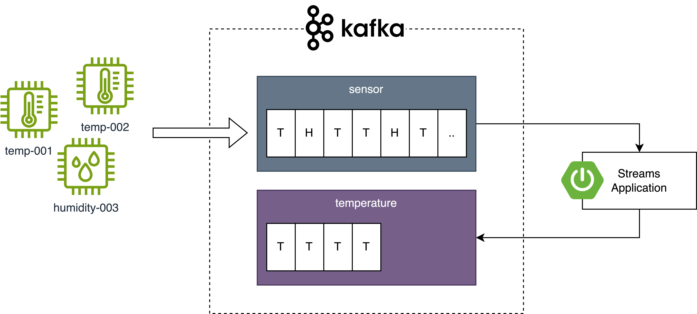
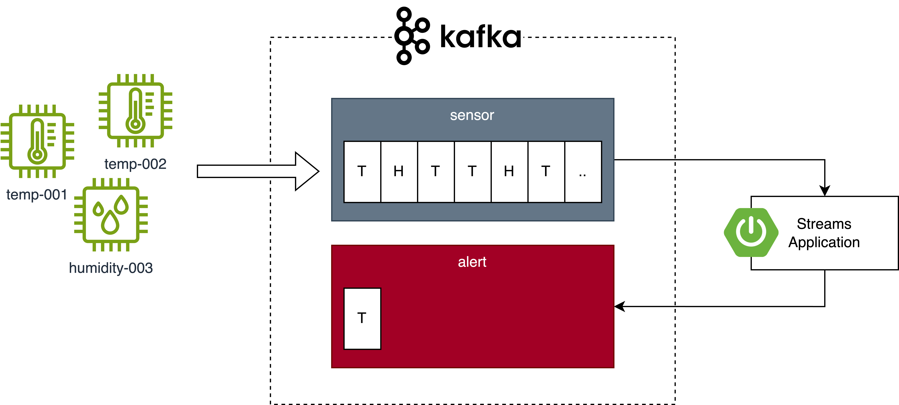
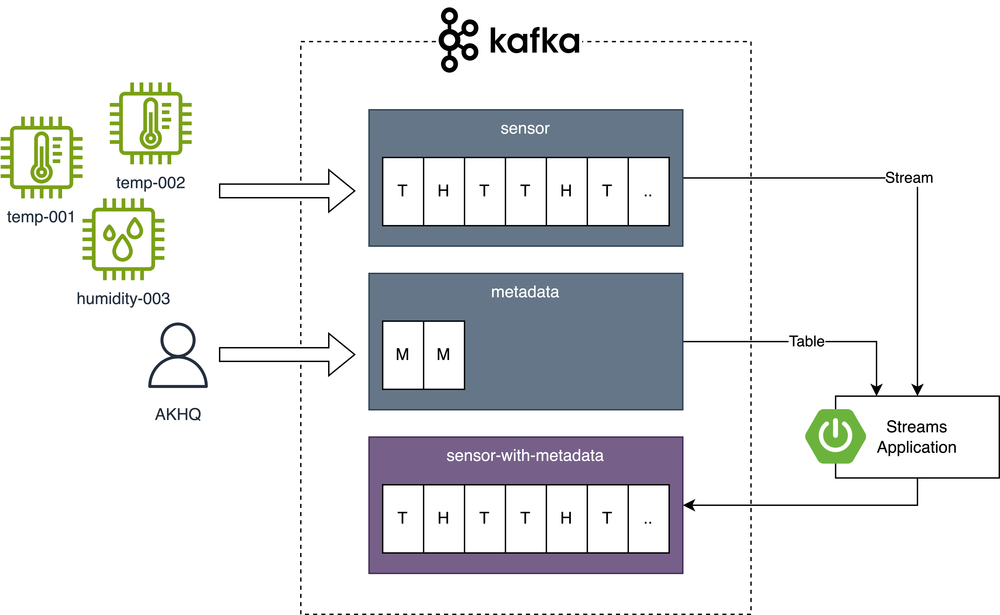

# Kafka Streams

## Initial Setup


Run Maven Build

```
mvn clean install
```

Start docker compose

```
docker compose up -d --build
```

Open AKHQ

http://localhost:8080/ui/docker-kafka-server/topic/sensor

## Excercise 1 - Create Temperature stream



* Create a stream to filter Temperature events
  * Navigate to the maven
    project [stream01-first-stream](stream01-first-stream/src/main/java/com/oepfelbaum/training/kafka)

## Excercise 2 - Create Alert stream



* Create a stream to filter Temperature events with a value higher than 80 and write them to a new topic
  * Navigate to the maven project [stream02-alert](stream02-alert/src/main/java/com/oepfelbaum/training/kafka)

## Excercise 3 - Join with metadata



Goals:

* Unterstand GlobalKTables and Join Operations

Preparation:

* Navigate to [AKHQ](http://localhost:8080/ui/docker-kafka-server/topic) to create the `metadata` topic
    * Register the metadata schema
        * In the sidebar, select Schema Registry
        * Select Button 'Create a Subject'
        * Enter Subject `metadata`
        * Enter schema from [sensor-metadata.avsc](stream03-join-metadata/src/main/resources/avro/sensor-metadata.avsc)
        * Click 'Create'
    * Create a new topic
        * Select Button 'Create a topic'
        * Enter Name `metadata`
        * Click 'Create'
    * Add metadata to topic
        * Select topic `metadata` and click on magnifier icon
        * Select Button 'Produce to Topic'
        * Enter Key `temp_001`, Value schema `metadata` and Value
          ```
          {
            "sensor_id": "temp_001",
            "model": "TS-100"
          }
          ```
        * Enter Key `humidity_003`, Value schema `metadata` and Value
          ```
          {
            "sensor_id": "humidity_003",
            "model": "HS-200"
          }
          ```

Excercise:

* Join the `sensor` stream with the `metadata` table using the keys
* Expand `SensorMeasurement` with data from `metadata`
* Write the result to a new Kafka Topic