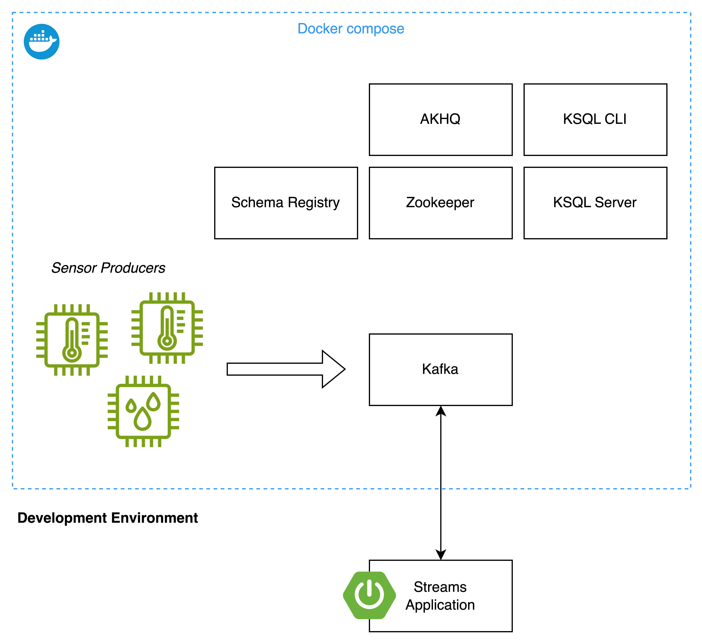

# Kafka Streams

## Initial Setup



Run Maven Build

```
mvn clean install
```

Start docker compose

```
docker compose up -d --build
```

Open AKHQ

http://localhost:8080/ui/docker-kafka-server/topic/sensor

## Excercise 1 - Create Temperature stream

Navigate to the `streams` maven project

### Excercise 2 - Create Alert stream

* Create a second stream to filter Temperature events with a value higher than 80 and write them to a new topic

## Excercise 3 - Join with metadata

Goals:

* Unterstand GlobalKTables and Join Operations

Preparation:

* Navigate to [AKHQ](http://localhost:8080/ui/docker-kafka-server/topic) to create the `metadata` topic
    * Register the metadata schema
        * In the sidebar, select Schema Registry
        * Select Button 'Create a Subject'
        * Enter Subject `metadata`
        * Enter schema from [sensor-metadata.avsc](streams/src/main/resources/avro/sensor-metadata.avsc)
        * Click 'Create'
    * Create a new topic
        * Select Button 'Create a topic'
        * Enter Name `metadata`
        * Click 'Create'
    * Add metadata to topic
        * Select topic `metadata` and click on magnifier icon
        * Select Button 'Produce to Topic'
        * Enter Key `temp_001`, Value schema `metadata` and Value
          ```
          {
            "sensor_id": "temp_001",
            "model": "TS-100"
          }
          ```
        * Enter Key `humidity_003`, Value schema `metadata` and Value
          ```
          {
            "sensor_id": "humidity_003",
            "model": "HS-200"
          }
          ```

Excercise:

* Join the `sensor` stream with the `metadata` table using the keys
* Expand `SensorMeasurement` with data from `metadata`
* Write the result to a new Kafka Topic

## Exercise 4 - Calculate the average value for a sensor over a 1min time frame

Goals:

* Understand Stateful Operations in Kafka Streams
* Unterstand Windowing in Kafka Streams

Exercise:

* Use the template [Exercise3Stream.java](streams/src/main/java/com/oepfelbaum/training/kafka/Exercise03Stream.java) to
  implement a stream
* Filter by key to only get sensor values

## Notes

* Multiple KStreams in one Spring Boot
  Application: https://ncodify.medium.com/multiple-kafka-stream-configurations-in-a-spring-boot-application-9ac342ed67d8
* Exception handling
    * Deserialization exception handler (eg. message not corresponding to schema)
        * Default: shutdown stream app
        * Use `default.deserialization.exception.handler` property to set error handler. Use built in (
          eg. `LogAndContinueExceptionHandler`) or provide custom handler.